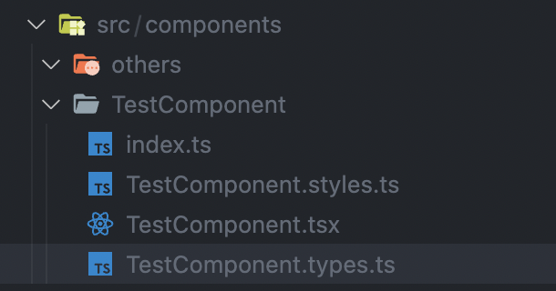

# React Component Folder Generator


## 🗂 What is m-rcfg?

This package is built for component folder generator who use react and has specific folder template.

> ~~m means for m of minoo~~

## 🚗 Installation

```bash
# using yarn
yarn global add react-component-folder-generator
```

```bash
# using npm
npm install -g react-component-folder-generator
```

Note: add --save if you are using npm < 5.0.0

## ⚙️ Configuaration Template

### Case of No have Own template

If you don`t want customize your own template just command like below!

```bash
# m-rcfg generate -n <YOUR_COMPONET_FOLDER_NAME>
m-rcfg generate -n TestComponent
```

Default output location is src/components
So,result is Below




### Case of your Own template

1. make folder in your workspace name `.template`
2. run command

   ```bash
   m-rcfg doc
   ```

3. custom your doc in `.template > template.json`

| Name   | Type   | Default             | Description                                                                                                                    |
| ------ | ------ | ------------------- | ------------------------------------------------------------------------------------------------------------------------------ |
| prefix | string | \_\_M_COMPONENT\_\_ | Specify your component template file <br/> You can custom this file, but if change file name, make sure this value also change |
| output | string | ./src/components    | Define where components folder output Path                                                                                     |

## 🚕 Example

> You can use npx

```bash
npx react-component-folder-generator -n TestComponent
```
