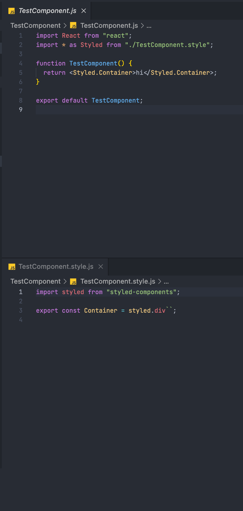

# React Component Folder Generator


> 🚧 It's still a project under development.  
> 🙇‍♂️ Please Wait v0.2.0...

## 🗂 What is rcfg?

This package is built for component folder generator who use react and has specific folder template.

## 🚗 Installation

```bash
# using yarn
yarn global add react-component-folder-generator
```

```bash
# using npm
npm install -g react-component-folder-generator
```

Note: add --save if you are using npm < 5.0.0

## 🚕 Example

> Yan use npx

```bash
npx react-component-folder-generator -n TestComponent
```

### Case of No have Own template

```bash
# m-rcfg generate -n <YOUR_COMPONET_FOLDER_NAME>
m-rcfg generate -n TestComponent
```

results is below



### Case of your Own template

1. make folder in your workspace name `.template`
2. run command

   ```bash
   m-rcfg doc
   ```

3. custom your doc in `.template > template.json`

| Name              | Type                                   | Default                | Description                                                                                                                   |
| ----------------- | -------------------------------------- | ---------------------- | ----------------------------------------------------------------------------------------------------------------------------- |
| componentFilePath | string                                 | \_\_M_COMPONENT\_\_.js | Specify your component template file <br/> You can custom this file, but if change file name, make sure this path also change |
| style             | "styled-components" \| "scss" \| "css" | styled-components      | kind of your styling methods for component.                                                                                   |
| indexJs           | boolean                                | true                   | It is Using for can import by forder name                                                                                     |
